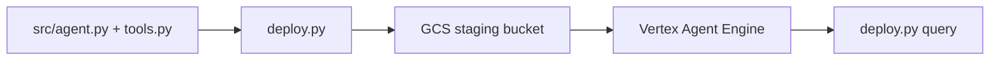

# Deploying an AI Agent with Google Vertex Agent Engine

A production-style layout for deploying a **LangGraph** agent to **Vertex AI Agent Engine**, based on Google's [tutorial_langgraph.ipynb](https://github.com/GoogleCloudPlatform/generative-ai/blob/main/gemini/agent-engine/tutorial_langgraph.ipynb).

The agent uses the `LanggraphAgent` template with a custom product-catalog tool, deploys to managed Agent Engine, and supports local testing, remote queries, and teardown via a CLI.

## Architecture



- **Local:** `src/` defines the agent; `deploy.py local` or `notebooks/development.ipynb` run queries against Gemini before deploy.
- **Deploy:** `deploy.py deploy` bundles `src/` and uploads to your staging bucket, then creates an Agent Engine resource.
- **Remote:** `deploy.py query` calls the deployed agent API.

## Prerequisites

- Google Cloud project with **billing** enabled
- [Vertex AI API](https://console.cloud.google.com/flows/enableapi?apiid=aiplatform.googleapis.com) and Cloud Storage API enabled
- Python 3.10+
- [Google Cloud SDK](https://cloud.google.com/sdk/docs/install) with `gcloud auth application-default login`

First-time GCP setup: see [docs/gcp-setup.md](docs/gcp-setup.md).

## Quickstart

```bash
python -m venv .venv
source .venv/bin/activate
pip install -r requirements.txt
cp .env.example .env   # edit with your project ID and staging bucket
```

Local test (no deploy):

```bash
python deploy.py local --prompt "Get product details for headphones"
```

Deploy, query, delete:

```bash
python deploy.py deploy
python deploy.py query --prompt "Get product details for headphones"
python deploy.py delete
```

## Project layout

```
production-langgraph-agent/
├── deploy.py              # CLI: deploy | query | delete | local
├── src/
│   ├── agent.py           # LanggraphAgent factory
│   └── tools.py           # get_product_details tool
├── notebooks/
│   └── development.ipynb  # Local sandbox only
└── docs/
    └── gcp-setup.md       # GCP bootstrap guide
```

## Local development notebook

Open `notebooks/development.ipynb` to prototype against `src/` without deploying. Remote steps use `deploy.py`.

## Cost and cleanup

Agent Engine charges while a deployment is running. Always run `python deploy.py delete` after demos. See [docs/gcp-setup.md](docs/gcp-setup.md) for bucket cleanup notes.

## Reference

- [Vertex AI Agent Engine overview](https://cloud.google.com/vertex-ai/generative-ai/docs/agent-engine/overview)
- [LanggraphAgent template](https://cloud.google.com/vertex-ai/generative-ai/docs/agent-engine/develop/langgraph)
- [Google Cloud generative-ai tutorial](https://github.com/GoogleCloudPlatform/generative-ai/blob/main/gemini/agent-engine/tutorial_langgraph.ipynb)
